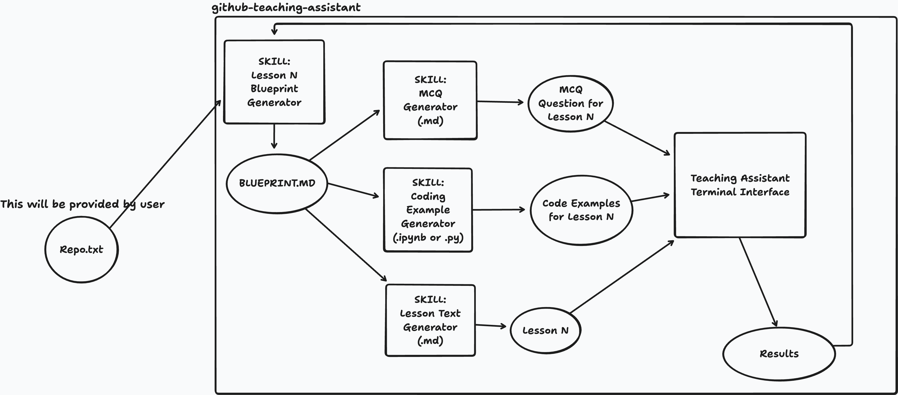

# GitHub Training Assistant

An AI-powered CLI tool that generates interactive, adaptive lessons from any GitHub repository. Drop in a repo snapshot, run a slash command, and Claude generates a full personalized curriculum — paginated lessons, coding exercises, and quizzes — presented in a terminal UI.



## How it works

1. **Ingest a repo** — use [gitingest](https://github.com/cyclotruc/gitingest) to snapshot any GitHub repo into a single text file
2. **Run the background assessment** — the TUI asks a few questions to calibrate lesson difficulty to your experience level
3. **Generate a lesson** — the `/next-lesson` Claude Code slash command plans the curriculum, writes lesson content, coding exercises, and MCQs in parallel
4. **Learn interactively** — the TUI walks you through the lesson page by page, then coding exercises, then a quiz, then collects your feedback
5. **Repeat** — each new lesson adapts based on what you struggled with or skipped

## Requirements

- [Claude Code](https://claude.ai/code) (CLI)
- Python 3.13+
- [uv](https://docs.astral.sh/uv/)
- [gitingest](https://github.com/cyclotruc/gitingest)

## Setup

```bash
# 1. Use this template to create your own repo, then clone it
git clone https://github.com/your-username/your-repo
cd your-repo

# 2. Install dependencies
uv sync

# 3. Ingest a GitHub repo you want to learn
gitingest https://github.com/user/repo --output input/my-repo.txt
```

## Usage

```bash
# Start the TUI — runs background assessment on first launch
uv run python src/terminal_interface.py my-repo

# After assessment, generate the first lesson in Claude Code
/next-lesson

# Then launch the TUI to take the lesson
uv run python src/terminal_interface.py my-repo

# Jump to a specific lesson
uv run python src/terminal_interface.py my-repo 3
```

## Slash commands

All commands are available inside Claude Code:

| Command | Description |
|---|---|
| `/next-lesson [repo]` | Full pipeline: curriculum → blueprint → lesson + exercises + MCQ in parallel |
| `/generate-curriculum [repo]` | Generate the full lesson sequence plan |
| `/generate-blueprint [repo]` | Generate the blueprint for the next lesson |
| `/generate-lesson [repo]` | Generate lesson text from blueprint |
| `/generate-examples [repo]` | Generate coding exercises from blueprint |
| `/generate-mcq [repo]` | Generate quiz questions from blueprint |

## Project structure

```
input/                          # Drop <repo-name>.txt files here (gitingest output)
training/<repo-name>/
  curriculum.md                 # Lesson sequence plan
  lessons/lesson_N/
    blueprint.md                # Lesson plan (drives all generation)
    lesson.md                   # Paginated lesson text
    examples.json               # Coding exercises
    mcq.json                    # Multiple choice questions
  results/
    lesson_0_background.json    # Learner background profile
    lesson_N_results.json       # Per-lesson performance and feedback
src/
  terminal_interface.py         # Terminal UI (rich + readchar)
.claude/commands/               # Claude Code slash command definitions
```

## Key design principles

- **Adaptive calibration** — blueprints read prior results; skipped exercises and "I don't know" MCQ answers trigger reinforcement in the next lesson
- **Progressive scope** — each blueprint has a "What NOT to Cover" section; concepts are never introduced before their lesson
- **Feedback loop** — the TUI collects free-text feedback after exercises and quizzes; the blueprint generator reads and acts on it
- **Multi-repo** — all paths are rooted at `training/<repo-name>/`; you can learn from multiple repos side by side
